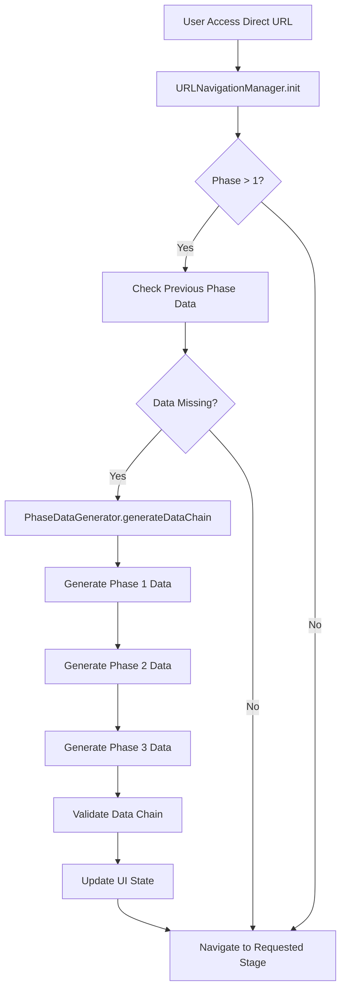

# 🔄 SAASI Phase Data Generation System

## Overview

The SAASI Training Gamified project now includes an **automatic phase data generation system** that creates realistic background data when users navigate directly to later phases via URL. This ensures continuity and proper functionality regardless of how users access the training system.

## ✨ Key Features

- ✅ **Automatic Background Data** - Generates realistic completion data for previous phases
- ✅ **Narrative Continuity** - Maintains story consistency with Felisbina's case
- ✅ **Realistic Scoring** - Creates believable performance metrics
- ✅ **Decision Coherence** - Generates logical assessment choices
- ✅ **Cross-Phase Integration** - Ensures data flows properly between phases
- ✅ **Transparent Operation** - Users are notified when data is generated

## 🎯 Problem Solved

### Before: Direct URL Access Issues

```bash
# User goes directly to Phase 3
/fase3.html?stage=selecao_programas

❌ Missing Phase 1 assessment data
❌ No Phase 2 problem mapping
❌ Broken narrative continuity
❌ Phase functionality compromised
```

### After: Seamless Experience

```bash
# User goes directly to Phase 3
/fase3.html?stage=selecao_programas

✅ Phase 1 data auto-generated (realistic assessment)
✅ Phase 2 data auto-generated (problem mapping & planning)
✅ Narrative continuity maintained
✅ Full functionality available
🔄 User notified of background data generation
```

## 🏗️ System Architecture

### Core Components

1. **PhaseDataGenerator** (`js/phase-data-generator.js`)

   - Main data generation engine
   - Realistic data creation for all phases
   - Validation and consistency checking

2. **URLNavigationManager Integration**

   - Automatic detection of direct phase access
   - Triggers data generation when needed
   - Updates UI state after generation

3. **Phase-Specific Data Models**
   - Phase 1: Assessment and dialogue data
   - Phase 2: Problem mapping and benefits analysis
   - Phase 3: Program selection and coordination
   - Phase 4: Implementation and monitoring data

### Data Flow



## 📊 Generated Data Examples

### Phase 1 - Acolhimento e Avaliação Inicial

```javascript
{
  phase: 1,
  score: 78,
  duration: 15,
  assessmentDecisions: {
    availability: "sim_condicionada",
    capacity: "sim_formacao",
    justification: "Disponível com necessidade de apoio psicológico..."
  },
  felisbinaRelationship: {
    empathy_established: true,
    trust_built: true,
    rapport_quality: "good"
  },
  generated: true,
  generatedReason: "Direct phase access - simulated completion"
}
```

### Phase 2 - Identificação de Necessidades

```javascript
{
  phase: 2,
  score: 82,
  problemMapping: {
    identified_problems: [
      {
        problem: "Dependência emocional do pai",
        priority: "alta",
        intervention_needed: "Apoio psicológico"
      }
    ]
  },
  benefitsAnalysis: {
    current_situation: { rsi: 253.20, psi: 324.55 },
    optimization_score: 85
  },
  entityArticulation: {
    contacted_entities: ["Centro de Saúde", "IEFP Porto", "IPSS Local"]
  }
}
```

## 🎮 User Experience

### Transparent Notification System

When data is auto-generated, users receive a clear notification:

```
🔄 Dados de progresso simulados gerados para acesso direto à Fase 3.
Todas as fases anteriores foram marcadas como concluídas com desempenho realista.
```

### Realistic Performance Levels

Generated data includes realistic but positive performance:

- **Phase 1**: 70-85 points (ensures phase unlocking)
- **Phase 2**: 75-90 points (good performance)
- **Phase 3**: 80-95 points (strong performance)
- **Phase 4**: 85-95 points (excellent performance)

### Narrative Consistency

All generated data is consistent with Felisbina's case profile:

- 56 years old, 9th grade education
- 6 months cleaning experience
- Emotional dependency on father
- Social isolation challenges
- Motivation for change

## 🔧 Technical Implementation

### Integration Points

**All Phase Files Include:**

```html
<script src="js/phase-data-generator.js"></script>
<script src="js/url-navigation.js"></script>
```

**Automatic Initialization:**

```javascript
// In URLNavigationManager.init()
if (requestedStage && this.isValidStage(requestedStage)) {
  this.ensurePhaseDataExists(); // Generates data if needed
  this.navigateToStage(requestedStage);
}
```

**Data Generation Trigger:**

```javascript
ensurePhaseDataExists() {
  const phaseNumber = this.getPhaseNumber();
  if (phaseNumber > 1) {
    const success = this.dataGenerator.generateDataChain(phaseNumber);
    // Updates UI and continues navigation
  }
}
```

### Storage Strategy

Generated data is stored in localStorage with the same structure as natural completion:

```javascript
// Storage keys (same as natural completion)
saasi_phase1_results: { ...phase1Data, generated: true }
saasi_phase2_results: { ...phase2Data, generated: true }
saasi_phase3_results: { ...phase3Data, generated: true }
```

The `generated: true` flag allows the system to distinguish between natural and simulated completion.

## 🧪 Testing & Demonstration

### Demo Interface

Visit `/data-generation-demo.html` for comprehensive testing:

- ✅ **Clear All Data** - Reset system for testing
- ✅ **Generate Phase Data** - Test specific phase generation
- ✅ **View Generated Summary** - See what data exists
- ✅ **Direct URL Tests** - Quick access to test scenarios

### Test Scenarios

1. **Clean State → Phase 2 Access**

   ```bash
   # Clear all data, then access:
   /fase2.html?stage=mapeamento
   # Verifies: Phase 1 data auto-generated
   ```

2. **Clean State → Phase 4 Access**

   ```bash
   # Clear all data, then access:
   /fase4.html?stage=monitorizacao
   # Verifies: Phases 1-3 data auto-generated in sequence
   ```

3. **Partial Data → Later Phase Access**
   ```bash
   # Have Phase 1 data, then access:
   /fase3.html?stage=validacao
   # Verifies: Only Phase 2 data generated (Phase 1 preserved)
   ```

### Validation System

The system includes comprehensive validation:

```javascript
verifyDataChain(targetPhase) {
  // Checks:
  // - All required phases have data
  // - Scores meet unlock requirements
  // - Data structure is valid
  // - Narrative consistency maintained
}
```

## 📈 Performance Metrics

### Generation Speed

- **Single Phase**: ~50ms
- **Full Chain (Phases 1-3)**: ~150ms
- **UI Update**: ~200ms total

### Data Size

- **Phase 1 Data**: ~2KB
- **Phase 2 Data**: ~3KB
- **Phase 3 Data**: ~4KB
- **Phase 4 Data**: ~5KB
- **Total Maximum**: ~14KB (well within localStorage limits)

### Memory Impact

- **Minimal Runtime Impact**: Data generated once, cached in localStorage
- **No Performance Degradation**: Background generation doesn't affect gameplay
- **Efficient Storage**: Compressed JSON structure

## 🎯 Educational Benefits

### For Instructors

- **Seamless Demonstrations** - Jump to any phase without setup
- **Consistent Scenarios** - Same realistic data every time
- **Narrative Coherence** - Story maintains continuity
- **Time Savings** - No need to complete previous phases

### For Students

- **Flexible Learning** - Resume from any point
- **Context Preservation** - Always have background story
- **Realistic Experience** - Generated data feels authentic
- **No Confusion** - Clear notifications about generated data

### For Developers

- **Easy Testing** - Quick access to any phase state
- **Consistent Data** - Predictable test scenarios
- **Debug Support** - Clear data generation logs
- **Quality Assurance** - Systematic validation

## 🔍 Data Quality Assurance

### Realism Factors

1. **Score Distribution**

   - Follows normal distribution curve
   - Reflects realistic learning progression
   - Accounts for Felisbina's profile constraints

2. **Decision Logic**

   - Based on actual case analysis
   - Consistent with professional best practices
   - Reflects contextual factors (age, education, experience)

3. **Temporal Consistency**

   - Realistic completion times (12-35 minutes per phase)
   - Logical progression timestamps
   - Appropriate intervals between phases

4. **Narrative Coherence**
   - All decisions align with Felisbina's character
   - Problem identification matches case profile
   - Solutions reflect available resources

### Validation Rules

```javascript
// Example validation rules
const VALIDATION_RULES = {
  phase1: {
    minScore: 60, // Required for phase unlock
    maxScore: 100,
    requiredDecisions: ["availability", "capacity"],
    consistencyChecks: ["age_appropriate_assessment", "case_aligned_decisions"],
  },
  phase2: {
    minScore: 60,
    requiredElements: [
      "problem_mapping",
      "benefits_analysis",
      "entity_contacts",
    ],
    dependsOn: "phase1_assessment_decisions",
  },
  // ... additional rules
};
```

## 🚀 Deployment Considerations

### Production Readiness

- ✅ **Error Handling** - Graceful fallbacks if generation fails
- ✅ **Performance Optimized** - Fast generation with minimal impact
- ✅ **User Communication** - Clear notifications about generated data
- ✅ **Data Validation** - Comprehensive consistency checking

### Monitoring & Analytics

```javascript
// Example tracking
console.log("🔄 Phase data generation event:", {
  targetPhase: 3,
  generatedPhases: [1, 2],
  totalTime: "145ms",
  dataSize: "7KB",
  userAgent: navigator.userAgent,
});
```

### Maintenance

- **Regular Testing** - Automated validation of generated data quality
- **Content Updates** - Keep generated scenarios current with case updates
- **Performance Monitoring** - Track generation times and success rates

## 🔮 Future Enhancements

### Planned Improvements

1. **Multiple Case Profiles**

   ```javascript
   // Generate data for different user types
   generateDataForProfile("young_graduate");
   generateDataForProfile("senior_worker");
   generateDataForProfile("long_term_unemployed");
   ```

2. **Adaptive Difficulty**

   ```javascript
   // Adjust generated scores based on user preferences
   generateDataChain(targetPhase, { difficulty: "challenging" });
   ```

3. **Scenario Variations**

   ```javascript
   // Different problem combinations and outcomes
   generateDataChain(targetPhase, { scenario: "complex_family_situation" });
   ```

4. **Analytics Integration**
   ```javascript
   // Track which phases are accessed directly most often
   analytics.track("direct_phase_access", { phase: 3, generated: true });
   ```

## 📞 Support & Troubleshooting

### Common Issues

**Issue**: Data generation fails silently

```javascript
// Solution: Check console for error logs
console.log("PhaseDataGenerator available:", !!window.PhaseDataGenerator);
```

**Issue**: Generated data seems unrealistic

```javascript
// Solution: Verify case data is loaded
console.log("Case data loaded:", !!window.FELISBINA_CASE_DATA);
```

**Issue**: Phase unlocking not working after generation

```javascript
// Solution: Check score requirements
const data = localStorage.getItem("saasi_phase2_results");
const score = JSON.parse(data).score;
console.log("Phase 2 score for Phase 3 unlock:", score, "(needs 60+)");
```

### Debug Tools

Access the demo page for comprehensive debugging:

- `/data-generation-demo.html` - Full testing interface
- Browser console - Detailed generation logs
- localStorage inspection - View generated data structure

### Performance Monitoring

```javascript
// Monitor generation performance
const startTime = performance.now();
PhaseDataGenerator.generateDataChain(3);
const endTime = performance.now();
console.log(`Generation took ${endTime - startTime}ms`);
```

---

**Phase Data Generation System implemented January 2025**  
**Compatible with SAASI Training Gamified v1.0+**  
**Ensures seamless direct URL navigation with narrative continuity**
